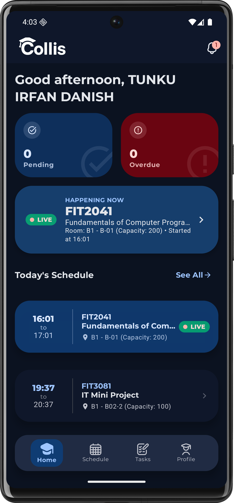
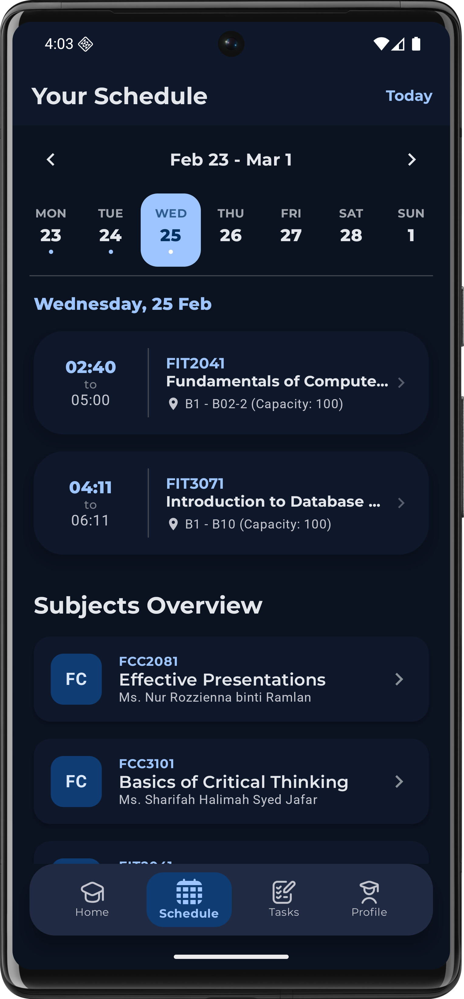
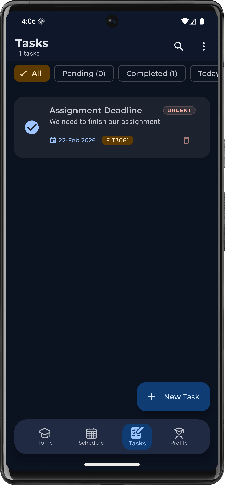
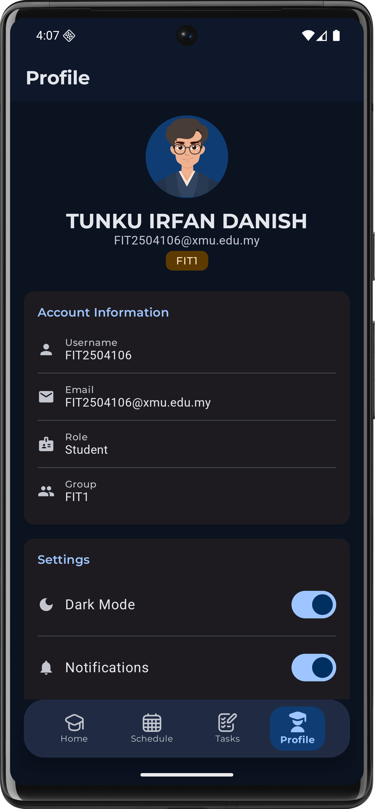
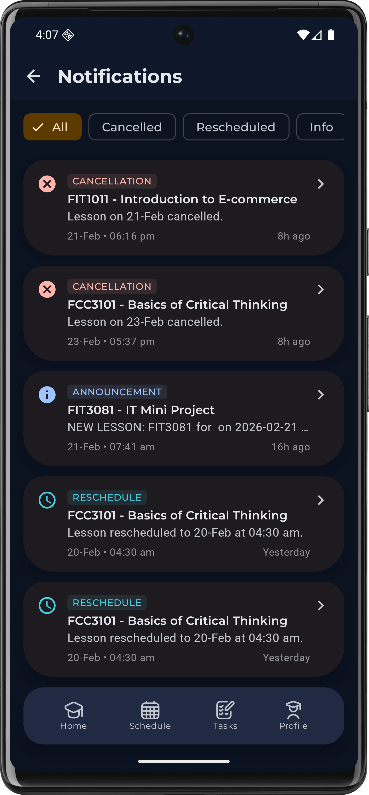

<p align="center">
  
</p>

<h1 align="center">Collis</h1>

<p align="center">
  <strong>College Live Schedule — Your Academic Life, Organized</strong>
</p>

<p align="center">
  
  
  
  
</p>

---

## Overview

**Collis** is a native Android application built for college students to manage their academic schedules, tasks, and announcements in one place. It connects to a **Django REST Framework** backend and provides a modern **Material Design 3** experience with real-time updates and offline capabilities.

---

## Screenshots

<p align="center">
  
  
  
  
  
  
</p>

---

## Features

### Authentication & Onboarding
- Animated splash screen that checks login status and routes automatically
- 3-page onboarding walkthrough for first-time users (schedule tracking, task management, notifications)
- Token-based login against Django REST API with real-time form validation and error handling

### Home Dashboard
- Personalized greeting with student name and notification badge
- **Live lesson indicator** — highlights the currently active class in real-time
- Today's schedule summary, upcoming tasks (top 5), and recent announcements (top 3)
- Pending and overdue task counters
- Pull-to-refresh for instant data refresh

### Weekly Timetable
- Week-by-week navigation with previous/next arrows and "Today" quick-jump
- Calendar day strip with dot indicators showing which days have lessons
- Lesson cards with course code, title, time range, room, lecturer, and **live status badge**
- Tap any lesson to view details and quickly create a linked task
- Data fetched from REST API with date filtering

### Task Manager
- **Offline-first** — all tasks stored in local Room database, no server dependency
- Full CRUD: create, edit, delete, toggle completion
- Search by title, filter by status (All / Pending / Completed / Overdue)
- Sort by due date, priority, or name
- 4 priority levels: Low, Medium, High, Urgent (color-coded)
- Link tasks to subjects from the timetable
- Swipe-to-delete with undo snackbar, bulk delete completed
- Repeat scheduling: Daily, Weekly, Monthly

### Reminders & Alarms
- Exact alarms via `AlarmManager.setExactAndAllowWhileIdle()` for precise timing
- Fullscreen alarm activity that wakes device and shows over the lock screen
- "I'M AWAKE (DONE)" marks task complete; "SNOOZE 10 MINS" reschedules
- Repeating tasks auto-calculate and schedule next occurrence
- All alarms survive device reboot via `BootReceiver`

### Notifications
- **WorkManager** polls the server every 15 minutes for new announcements
- **AlarmManager backup** ensures polling works even in Doze mode
- System notifications for class cancellations, reschedules, and general announcements
- In-app notification screen with type-based filter chips and pull-to-refresh

### Profile & Settings
- User info display: avatar, full name, email, group badge
- Dark/light mode toggle — instantly recomposes the entire app theme
- Notification enable/disable toggle
- Logout with confirmation dialog, clears all local data and tokens

---

## Architecture

The project follows **Clean Architecture** with the **MVVM** pattern:

```
┌──────────────────────────────────────────────────────┐
│  PRESENTATION                                         │
│  Compose Screens → ViewModels → UI State (StateFlow) │
├──────────────────────────────────────────────────────┤
│  DOMAIN                                               │
│  Use Cases → Repository Interfaces → Domain Models   │
├──────────────────────────────────────────────────────┤
│  DATA                                                 │
│  Retrofit API │ Room DB │ DataStore │ Repo Impls     │
└──────────────────────────────────────────────────────┘
```

**Key patterns:** Repository pattern, Dependency Injection (Hilt), Unidirectional Data Flow, Reactive Streams (Kotlin Flow & StateFlow), NetworkResult sealed class for API error handling.

---

## Tech Stack

| | Technology |
|--|-----------|
| **Language** | Kotlin 2.1.0 |
| **UI** | Jetpack Compose + Material 3 |
| **Architecture** | Clean Architecture + MVVM |
| **DI** | Dagger Hilt 2.59.1 |
| **Network** | Retrofit 3.0 + OkHttp 5.3 |
| **Local DB** | Room 2.7.0 |
| **Preferences** | DataStore 1.2.0 |
| **Background** | WorkManager 2.11 + AlarmManager |
| **Navigation** | Navigation Compose 2.9.7 |
| **Image Loading** | Coil 2.7.0 |
| **Build** | Gradle (Kotlin DSL) + KSP, AGP 9.0.0 |

---

## Project Structure

```
app/src/main/java/com/example/collis/
├── core/           # Navigation, receivers, workers, utilities
├── data/           # API service, Room DB, DataStore, DTOs, repo impls
├── di/             # Hilt modules (AppModule, RepositoryModule)
├── domain/         # Domain models, repository interfaces, use cases
├── presentation/   # Compose screens, ViewModels, reusable components
├── ui/theme/       # Theme, colors, typography (Montserrat + Roboto)
└── MainActivity.kt
```

---

## API

**Base URL:** `https://collis.pythonanywhere.com/api/`  
**Auth:** Token-based (`Authorization: Token <key>`)  
**Docs:** `/api/schema/swagger-ui/`

| Method | Endpoint | Description |
|--------|----------|-------------|
| POST | `/api/token/` | Login (returns auth token) |
| GET | `/api/profiles/me/` | Current user profile |
| GET | `/api/lessons/` | Lessons (filterable by date) |
| GET | `/api/notifications/` | Server announcements |
| GET | `/api/courses/` | Available courses |
| GET | `/api/groups/` | Student groups |

---

## Getting Started

1. Clone the repo and open in **Android Studio**
2. Wait for Gradle sync to complete
3. Run on a device or emulator (API 24+)
4. Login with credentials provided by the administrator

---

<p align="center">
  Built with ❤️ using Kotlin & Jetpack Compose
</p>
